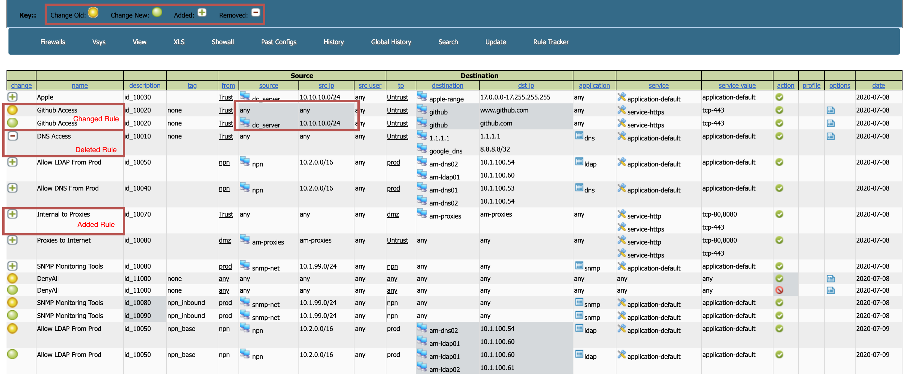
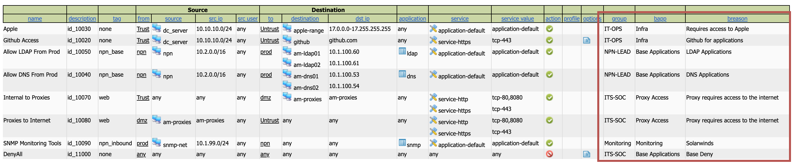
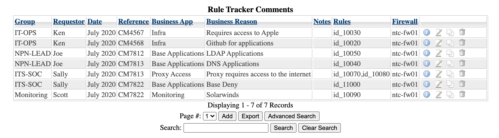
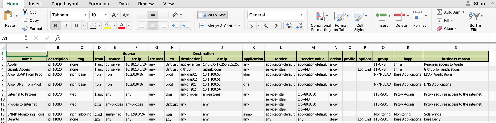
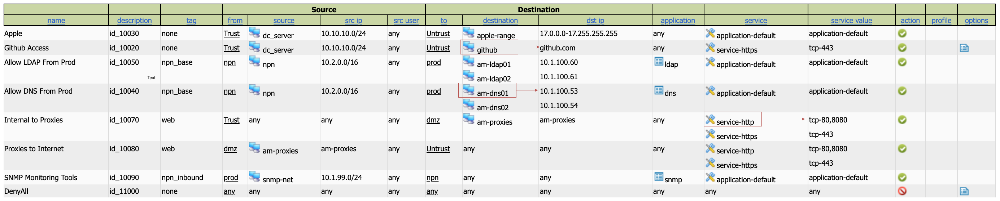
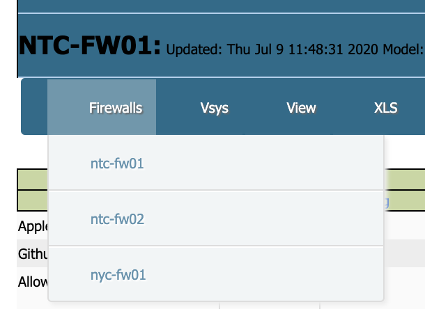
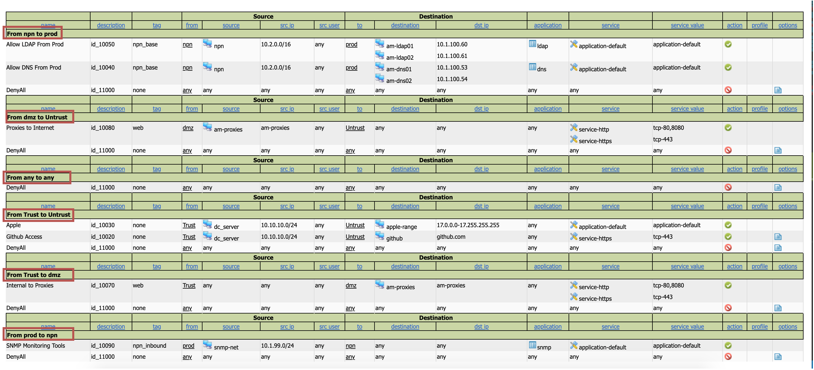
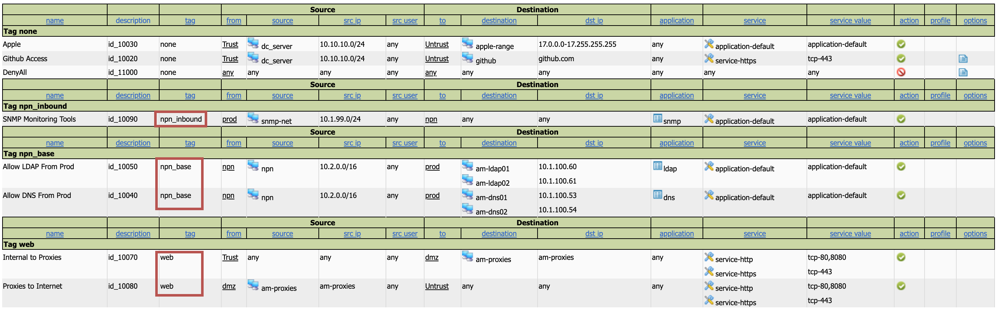

Palo_Alto_to_HTML
=================

Script using API to pull down firewall rules and represent them in a webpage. 

###### Warning, this program has not been tested and is offered as is This requires you to keep a plain text file of your authkey's, review  your own secuirty process, to evaluate if this is ok
=================

**Install instructions:**

**Prerequisite**

```
Docker
Docker Compose
Make
```

**Setup Configuration Files**

Copy config.tmp.txt to config.txt in both folders

e.g. `cp config.tmp.txt config.txt`

```
- updated config.txt for any columns you don't want showing by default,
  - simply change any 1 to a 0
- Update Mysql password as needed
```

**Build and RUN Server**

```
make build
make deploy
```

This goes through all the FWs listed in fw.txt and creates xml

**Get Key**

Get keys by running getkey.pl script, which is exposed via a Make command.

make getkey.pl <device> <username> <password>
e.g.
```
./getkey.pl test-fw01.example.com admin password
```

**Fill out firewall file**

Copy fw.tmp.txt to fw.txt in pascripts directory

```
cp fw.tmp.txt fw.txt 
```

With that information populate fw.txt, ensuring there are always
2 commas as depicted in the file. The first column is the name as it shows, 
the next is the device it will connect to (think IP) if different then the
name in the first column


**Rule Tracking**


Fill out your mysql information in the config file in the script directory.  

The way the rule tracking works is based on an ID that if configured on the 
description field of the configuration matches the same ID in the mysql server, 
with either the firewall name or group as well. You can create a group using 
the fw.txt file and creating a 3rd comma on your grouped entries. This is useful 
if you use panorama and have the same policies across many firewalls. Be aware that
there is no vsys check, so do not overlap ID's between vsys on the same firewall.


e.g. fw.txt
```
site01-fw01,192.168.100.10,asodnaiasphfadsiufhadsoifhdsaf,offices
site02-fw01,,aosdhasiudhasiduhsada,offices
site03-fw01,,aosdhasiudhasiduhsada,offices
site04-fw01,,aosdhasiudhasiduhsada,offices
core01-fw01,,aosdhasiudhasiduhsada
```

In the above example all of the "site" firewalls will be in group offices, wheras
the core will be by itself. 

Under the "Rule Tracker Database" which you can only see after you click "Rule Tracker,"
the "Rules" column matches the description column in the actual config. You can have 
multiple firewall rules applied to one entry, just seperate them with a comma. This way if 
one request requires multiple rules, you can manage it that way. 

## Features

**Rule History**

Track when and how rules were updated, added, or deleted, with a simplified interface that has same look and feel as normal policy management.



**Rule Ownership**

The ability to track rule ownership, and link to a database. This is pretty powerful offering as it gives the ability to follow up with users and ensure they still "own" the rule.





**Export to Excel**

The ability to export the rule base, history, and ownership to a MS Excel document. This is helpful to send to auditors and security policy makers.



**Rule Object Extrapolation**

Provides a view of the rules "expanded" meaning, not only can you see the object, but you can also the value. Such as knowing that "am-ldap01" is "10.1.100.60", or "service-http" is "tcp-80,8080".



**Quick Navigation**

There is a quick navigation to switch between firewalls.



**Zone and Tag View**

The zone view allows you to see each view isolated to itself, this is especially helpful when the rule has a zone in the `any` zone. This will still show. Tag view is similar, but based on tag rather than zone.





There is also features to search, get global history (more than one device's rule history), view a previous version of the policy, refresh the process from the GUI, and manage the columns viewable to name a few.


## Demo

To Demo, you can copy the files from the `examples` directory, and put them into the `pascripts` directory. 
